# Package Classification

工业场景包裹图像分类项目。

当前主要完成的是 **4 类 NR 类型分类**，并基于高分辨率灰度图像完成了数据清洗、验证集重构、难例审计和模型优化。

---

## 项目概述

本项目面向工业场景中的包裹识别失败图像（NR 图像）分类任务，当前核心目标是对以下 4 类进行分类：

- `NoPackage`
- `NoWaybill`
- `TruncatedBarcode`
- `WrinkledWaybill`

项目后续可以扩展到完整的 **9 类 NR 类型体系**。

在项目推进过程中，主要完成了以下工作：

- 多轮数据集审计与清洗
- 验证集重构与扩充
- 由 RGB 处理切换为灰度单通道输入
- 屏蔽图像左下角缩略图区域
- 提高输入分辨率
- 针对关键混淆对进行定向分析与清洗
- 增加极难样本集合 `hard_val`

---

## 最终结果

### Final Model

- **Backbone**: ResNet34
- **Input Size**: 560 × 700
- **Batch Size**: 16
- **Best Epoch**: 14
- **Best Accuracy**: 0.9258
- **Best Macro-F1**: 0.9205

### 最终验证集结果

```text
                  precision    recall  f1-score   support
       NoPackage       1.00      0.87      0.93        60
       NoWaybill       0.91      0.99      0.95       112
TruncatedBarcode       0.90      0.85      0.87        61
 WrinkledWaybill       0.92      0.94      0.93        50

        accuracy                           0.93       283
       macro avg       0.93      0.91      0.92       283
    weighted avg       0.93      0.93      0.93       283
```

### 最终混淆矩阵

```text
GT \ Pred            NoPackage   NoWaybill   TruncatedBarcode   WrinkledWaybill
NoPackage            52          2           4                  2
NoWaybill            0           111         0                  1
TruncatedBarcode     0           8           52                 1
WrinkledWaybill      0           1           2                  47
```

### 各阶段结果汇总

| 版本       | 主要改动                                            | Accuracy | Macro-F1 | 说明                       |
| ---------- | --------------------------------------------------- | -------: | -------: | -------------------------- |
| Baseline 0 | ResNet50 初始可用模型                               |     0.75 |     0.65 | 初始 baseline              |
| v3         | ResNet18 + 224 输入 + 权重调整                      |     0.81 |     0.77 | 首次较稳定提升             |
| v4         | 头部训练 + 微调策略 + 新权重形式                    |     0.78 |     0.70 | 效果不如 v3 稳定           |
| v5         | WeightedRandomSampler + class weight                |     0.75 |     0.63 | 说明当时主瓶颈不在采样策略 |
| v6 round 1 | ResNet34 + 448×560 + 灰度 + 缩略图屏蔽 + 扩充验证集 |     0.86 |     0.86 | 联合改进阶段               |
| v6 round 2 | 数据清洗 + 验证集重构                               |     0.89 |     0.89 | 数据治理带来明显提升       |
| v6 round 3 | 提升分辨率到 560×700                                |     0.92 |     0.92 | 分辨率提升明确有效         |
| v6 final   | 小规模再清洗 + 最终封板                             |   0.9258 |   0.9205 | 最终版本      


详见 `Experiments.md`。

---

## 数据集说明

### 当前 4 类训练集

总计约 **9029 张图像**。

- `WrinkledWaybill`: 1465
- `NoPackage`: 507
- `TruncatedBarcode`: 1927
- `NoWaybill`: 5130

### 当前 4 类验证集

总计 **283 张图像**。

- `WrinkledWaybill`: 50
- `NoPackage`: 60
- `TruncatedBarcode`: 61
- `NoWaybill`: 112

### 数据集大小

- 约 **12.0 GiB**

### 图像：
数据集采集于一物流公司的传送带，数据由三台工业相机采集，分别从三个不同角度（顶部、前方、后方）拍摄
输出图像为灰度图，分辨率为 **5440 x 4352**

## 相机视角

### 后方相机


### 顶部与前方相机
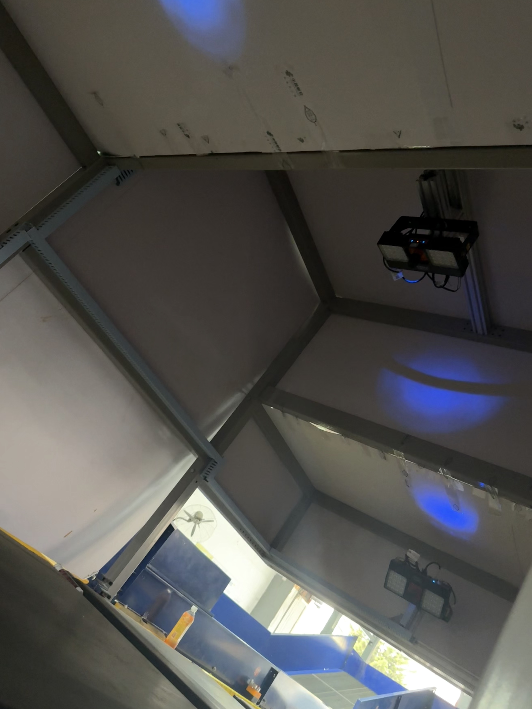

## 数据示例

### 前方
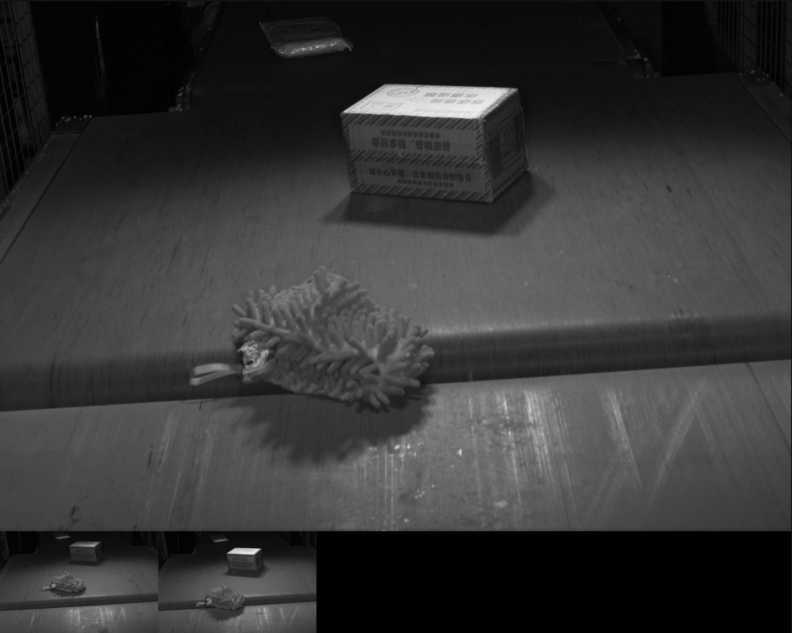

### 后方
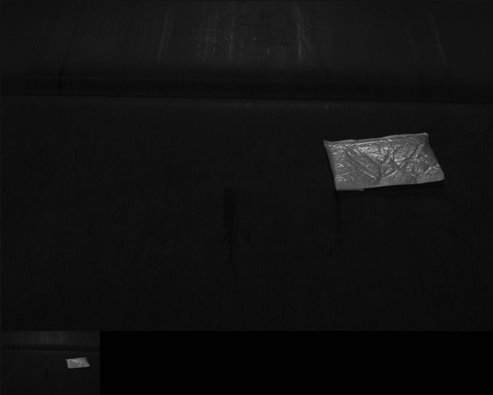

### 顶部
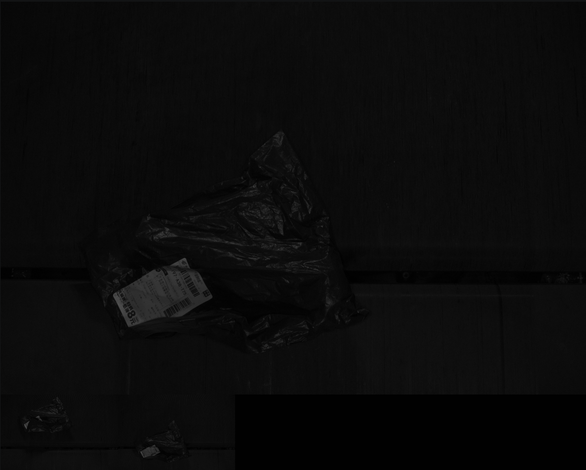

### `hard_val`

用于保存少量极难样本，仅用于额外参考，不参与 best model 选择。

当前规模较小，因此结果仅作定性参考，不作为核心指标。

---

## 类别定义

### `NoPackage`

当图中被识别对象不是包裹主体，而是散落物、杂物、非包裹目标时，标为 `NoPackage`。

例如：

- 纸巾
- 螺丝钉
- 零食
- 杂物

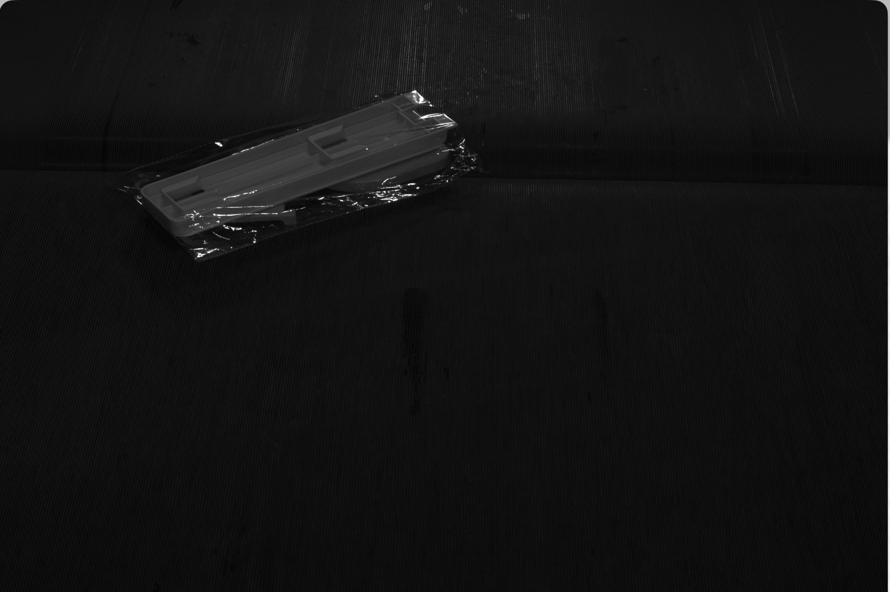

---

### `NoWaybill`

当前提是图中确实存在包裹主体，但包裹表面没有可见面单，或面单区域缺失、脱落、未贴附时，标为 `NoWaybill`。

该类别的核心特征是：**有包裹，但没有可供识别的面单信息**。

需要注意的是，若图中根本不是包裹，则应标为 `NoPackage`，而不是 `NoWaybill`。

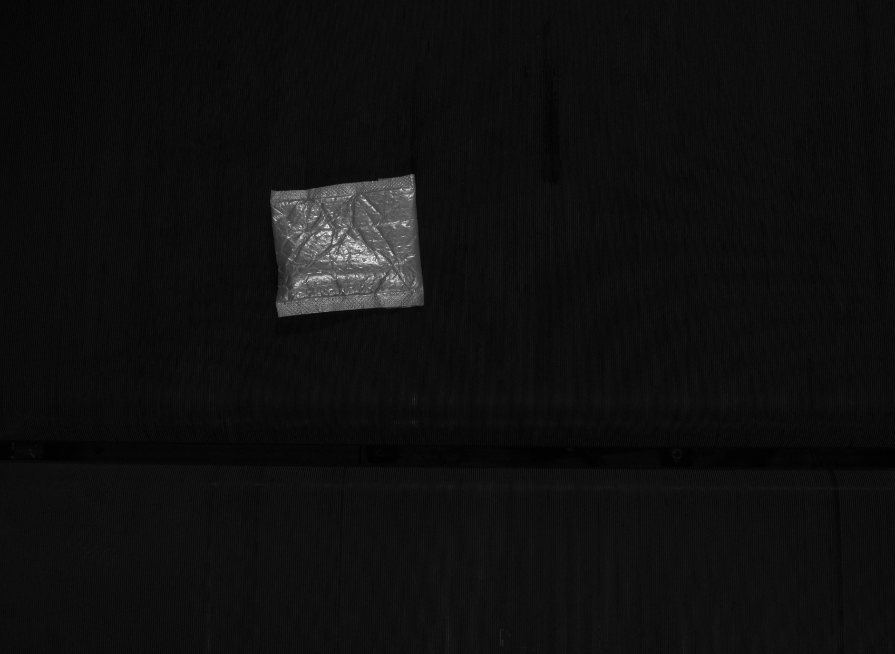

---

### `WrinkledWaybill`

当前提是图中存在包裹及其面单区域，但面单出现明显褶皱、折叠、起伏或局部遮挡，从而影响信息读取时，标为 `WrinkledWaybill`。

该类别的核心在于：**面单存在明显形变**，例如：

- 面单起皱
- 面单折叠
- 条码区域因褶皱发生局部扭曲
- 面单表面不平整导致信息区域变形


---

### `TruncatedBarcode`

当前提是图中确实存在包裹及其面单/条码区域，只是条码本身不完整或被截断时，标为 `TruncatedBarcode`。

该类别通常表现为：

- 条码只显示一部分
- 条码边界被裁掉
- 条码区域缺失一截
- 条码未完整出现在画面中

需要注意的是，该类别前提是**条码原本存在，但显示不完整**，而不是完全没有面单。

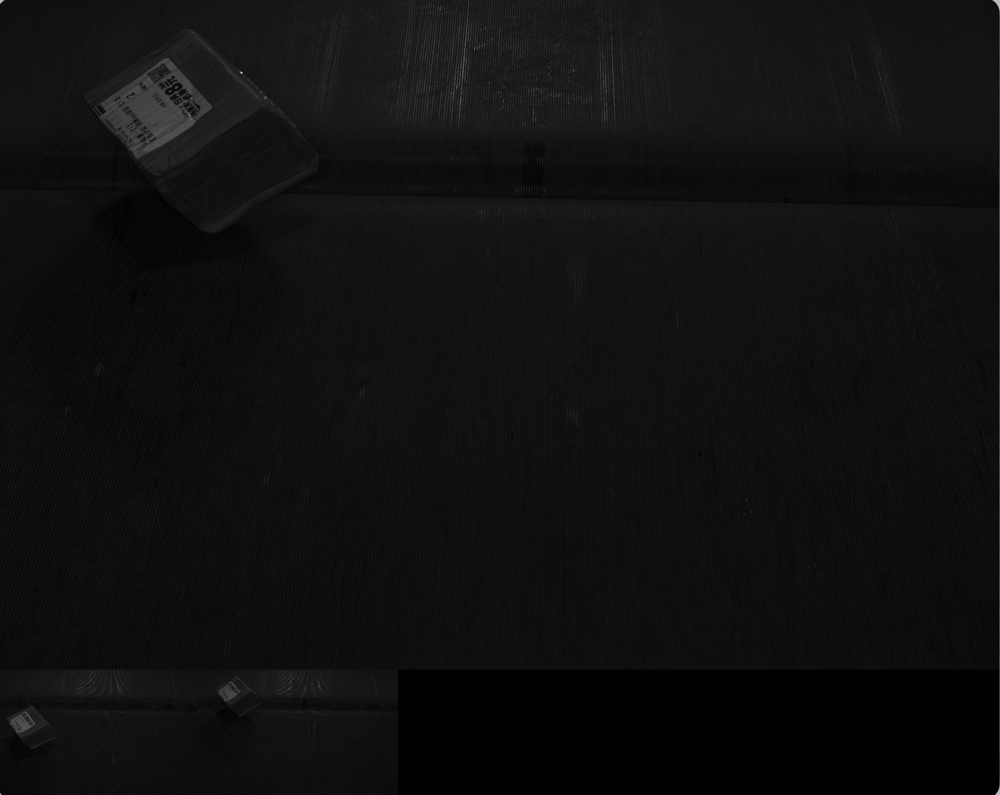

---

### `None`

当图像中的包裹与面单状态基本正常，不属于任何异常类别时，标为 `None`。

该类别表示当前图像虽然可能来自识别流程中的样本，但从图像本身来看，不存在明显的面单缺失、条码截断、褶皱、反光、模糊或光照不足等问题。

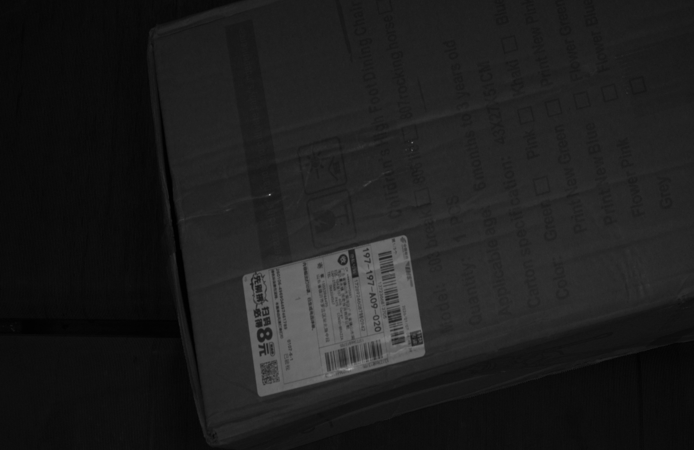

---

### `BlurryWaybill`

当前提是图中存在包裹及其面单区域，但面单本身内容模糊不清，导致文字、条码或关键信息难以辨认时，标为 `BlurryWaybill`。

该类别更强调**面单区域本身的内容模糊**，例如：

- 面单文字发虚
- 条码边缘不清晰
- 面单印刷区域整体糊成一片

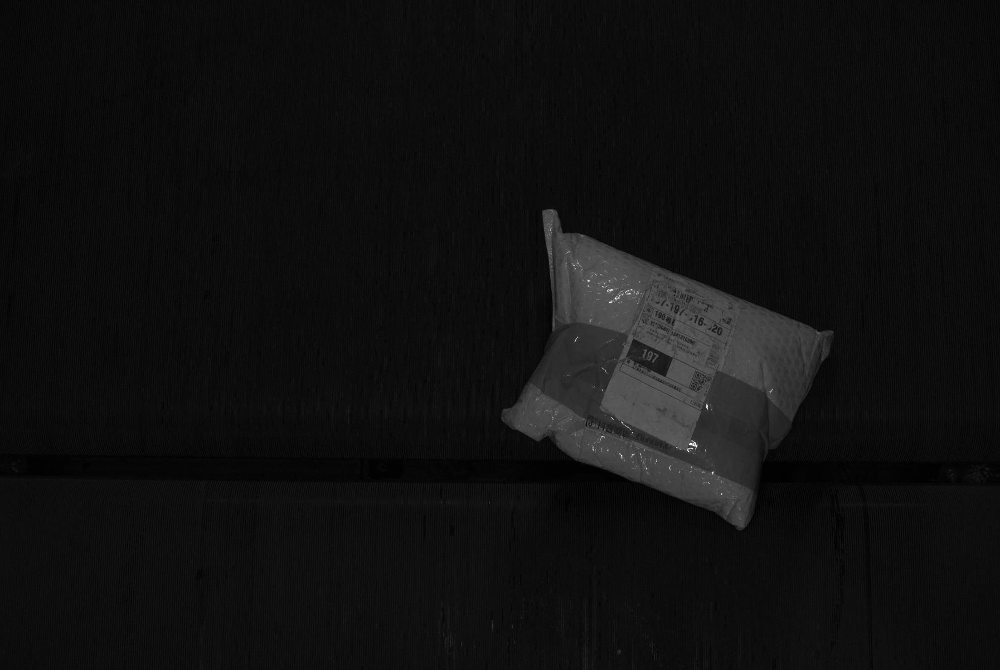

---

### `Reflection`

当前提是图中存在包裹及面单区域，但由于反光、高亮区域或镜面反射导致面单或条码信息被部分遮挡、淹没或难以识别时，标为 `Reflection`。

例如：

- 面单表面出现强反光
- 条码区域被高亮覆盖
- 局部过曝导致信息丢失

该类别强调的是**由反光造成的信息干扰**，而不是模糊或低分辨率问题。

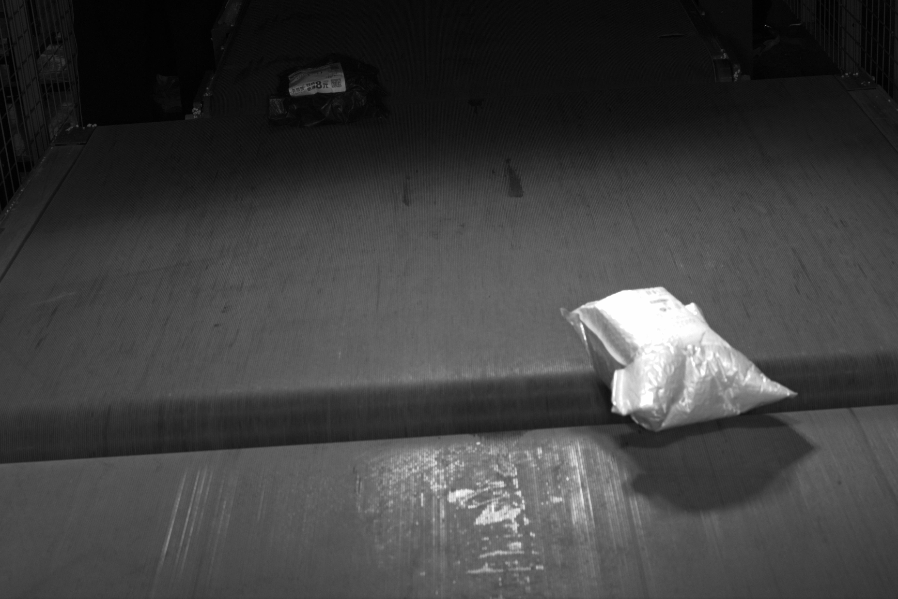

---

### `InsufficientLighting`

当前提是图中存在包裹及面单区域，但由于整体光线不足、局部过暗或曝光不足，导致面单或条码区域难以辨认时，标为 `InsufficientLighting`。

例如：

- 图像整体偏暗
- 面单区域亮度不足
- 条码处于阴影中
- 暗部细节严重丢失

该类别强调的是**照明条件不足**，与 `Reflection` 的“过亮”问题相对。

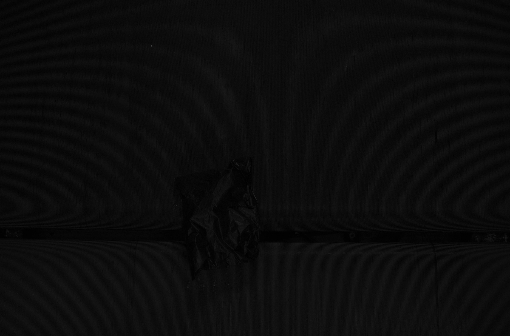

---

### `BlurryFocus`

当前提是图中存在包裹及面单区域，但由于拍摄失焦、运动模糊或整体清晰度不足，导致图像内容无法有效识别时，标为 `BlurryFocus`。

该类别通常表现为：

- 整张图像发虚
- 包裹轮廓不清
- 面单与背景都不清晰
- 焦点落在错误位置，导致目标区域失焦

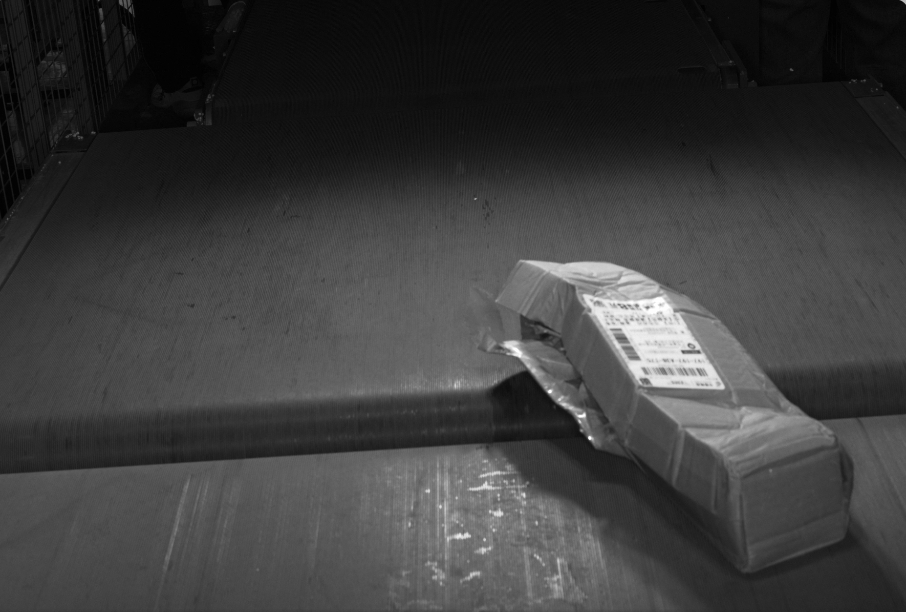


---

## 完整 9 类需求体系

按优先级排序如下：

1. `None`
2. `NoPackage`
3. `NoWaybill`
4. `BlurryWaybill`
5. `WrinkledWaybill`
6. `TruncatedBarcode`
7. `Reflection`
8. `InsufficientLighting`
9. `BlurryFocus`

### 当前完整 9 类数据分布

#### Train

- `Reflection`: 50
- `WrinkledWaybill`: 1465
- `NoPackage`: 507
- `InsufficientLighting`: 46
- `None`: 806
- `TruncatedBarcode`: 1927
- `BlurryFocus`: 72
- `BlurryWaybill`: 45
- `NoWaybill`: 5130

#### Val

- `Reflection`: 4
- `WrinkledWaybill`: 50
- `NoPackage`: 60
- `InsufficientLighting`: 1
- `None`: 9
- `TruncatedBarcode`: 61
- `BlurryFocus`: 5
- `BlurryWaybill`: 1
- `NoWaybill`: 112

---

## 模型与训练

### 当前最佳配置

- **Backbone**: ResNet34
- **Input Size**: 560 × 700
- **Batch Size**: 16
- **Optimizer**: AdamW
- **输入形式**: 灰度单通道
- **预处理**:
    - 屏蔽左下角缩略图区域
    - Resize
    - Normalize

### 高分辨率有效

本任务高度依赖局部细节，例如：

- 条码截断区域只占很小一部分
- 面单褶皱属于局部纹理特征
- 原始图像分辨率很高，而目标区域可能较小

将输入分辨率从较低分辨率提升到 **560 × 700** 后，模型性能获得了明确提升。

---

## 环境说明

### 硬件

- **GPU**: NVIDIA A40
- **训练显存占用**: 约 3716 MiB

### 使用 RAM Disk 加速训练

```bash
sudo mkdir -p /mnt/ramdisk
sudo mount -t tmpfs -o size=18G tmpfs /mnt/ramdisk
rsync -av /mnt/F/xezrio/PackageClassification/dataset/dataset_9_class /mnt/ramdisk/
```

---

## 常用命令（仅自用）

### 进入项目

```bash
cd /mnt/F/xezrio/PackageClassification/
tmux
source myenv/bin/activate
```

### 文件数量统计

```bash
find . -maxdepth 1 -type d -exec sh -c "echo -n '{}: '; find '{}' -maxdepth 1 -type f | wc -l" \;
```

### 查看当前目录下子文件夹大小

```bash
du -h --max-depth=1
```

---

## Quick Start

### 1.克隆项目并进入目录

```sh
git clone https://github.com/Xezrio/Package-Classification.git
cd Package-Classification
```

### 2. 创建并激活 Python 环境

```sh
python3 -m venv myenv
source myenv/bin/activate
pip install -r requirements.txt
```

### 3. 准备数据集

将数据集整理为 ImageFolder 结构，例如：
```sh
dataset_9_class/
├── train/
│   ├── NoPackage/
│   ├── NoWaybill/
│   ├── TruncatedBarcode/
│   └── WrinkledWaybill/
├── val/
│   ├── NoPackage/
│   ├── NoWaybill/
│   ├── TruncatedBarcode/
│   └── WrinkledWaybill/
└── hard_val/   # 可选，仅用于极难样本参考
    ├── NoPackage/
    ├── NoWaybill/
    ├── TruncatedBarcode/
    └── WrinkledWaybill/
```

### 4. 训练

当前最终版本训练脚本为：
```sh
python3 resnet34_560x700_final.py
```

使用审计脚本分析高loss样本、低置信样本与关键混淆对：
```sh
python3 audit_dataset.py
```


---

## 结论

本项目从一个初始 4 类 baseline 出发，经过多轮数据治理、验证集重构和模型优化，最终达到：

- **Accuracy**: 0.9258
- **Macro-F1**: 0.9205

当前主验证集上模型已经达到较高且较稳定的性能。

---

### 难点主要来源（图例见`Experiments.md`）
- 多特征共存但强制单标签（单个数据可以有多种错误，但是需求按照优先级只标注单标签）
- 有自动扩标历史（训练集内含脏数据）
- 数据集类别数据非常不均衡，最大类别数量可达最小类别数量约十倍
- 极难样本（特征难以区分）
- 图像巨大、目标不固定、缩略图干扰（包裹位置并不固定，而且图中可能出现多个包裹影响模型判断）

---

### 后续工作

进一步提升的主要瓶颈不再是基础模型结构，而更可能来自：
- 极难样本
- 标签边界模糊
- 单标签任务对多特征样本的天然限制

改进方向：
- 后续可以专门收集难例，做针对的`hard_val`训练，提高模型鲁棒性
- 补充训练集小类样本，可逐步扩充为九类别分类模型
- 采集更大规模、不同流水线传送带上的数据集，预计可显著增强模型在不同物流基地识别的泛化能力。
